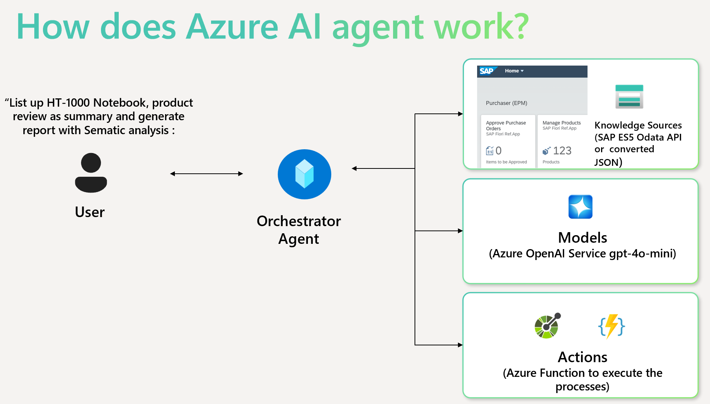
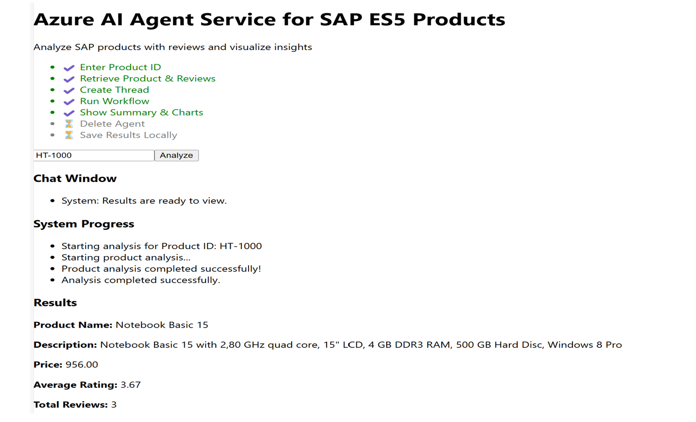

# Azure AI Agent Service Demo for SAP Products & Review

This repository showcases an **Azure AI Agent Service** that automates product insights and sentiment analysis for SAP products, such as **HT-1000**. The solution leverages **Azure AI Foundry SDK**, **Azure OpenAI**, and **Azure Functions** to streamline workflows for customer service managers.

## 🏗️ **How the AI Agent Works**
The demo enables users to retrieve real-time **product details**, analyze **customer reviews**, and generate **automated reports** using AI-driven workflows.



1. **User** enters a **Product ID** (e.g., `HT-1000`).
2. **Orchestrator Agent** (powered by **Azure AI Agent Service**) processes the request.
3. **Models** (Azure OpenAI `gpt-4o-mini`) perform **semantic analysis** and review summarization.
4. **Actions** (Azure Functions) execute backend logic to fetch data and generate reports.
5. **Data Sources**: Product data is retrieved from **SAP ES5 OData API** or pre-converted JSON files.

---

## ⚙️ **Tech Stack & Components**
This project is built using **Azure AI and SAP integration**, including:

- **Azure AI Foundry SDK** → Creates, manages, and orchestrates AI agents.
- **Azure Functions** → Hosts API endpoints for analysis and product retrieval.
- **Azure OpenAI (GPT-4o-mini)** → Performs NLP-based semantic analysis and summarization.
- **SAP OData API** → Fetches product details and customer reviews.
- **React Frontend** → Allows users to enter Product IDs and visualize results.
- **Python Backend** → Implements orchestration logic and integrates with Azure services.
- **Visualization Libraries** → Generates bar and pie charts for sentiment analysis.

---

## 🚀 **Setup Instructions**

### **1️⃣ Clone the Repository**
```sh
git clone https://github.com/cjpark-sapcsa/azure-ai-agent-demo-sapes5.git
cd azure-ai-agent-demo-sapes5
```

### **2️⃣ Install Dependencies**

#### Backend (Python)
```sh
cd backend
pip install -r requirements.txt
```

#### Frontend (React)
```sh
cd frontend
npm install
```

### **3️⃣ Configure Environment Variables**

#### **Prerequisites**
Make sure you have the necessary access and permissions to create models via **Azure AI Foundry**. 
You can find your **Project Connection String** in the **Azure AI Foundry portal**, under **Project details > Project connection string**.

For more details, refer to the Microsoft documentation:  
🔗 [Azure AI Agent Quickstart Guide](https://learn.microsoft.com/en-us/azure/ai-services/agents/quickstart?pivots=programming-language-python-azure)

#### **Setting Up the Connection String**
Create a `.env` file inside `backend/` and add:
```sh
PROJECT_CONNECTION_STRING="your-azure-ai-connection-string"
```
Ensure the `.env` file is excluded from Git by adding it to `.gitignore` to keep sensitive credentials secure.

### **4️⃣ Run the Services**

#### Start the Azure Functions Backend:
```sh
cd backend
func start
```

#### Start the React Frontend:
```sh
cd frontend
npm start
```

---

## 🎯 **Usage Instructions**

Once the services are running:

1️⃣ Open `http://localhost:3000` in your browser.  
2️⃣ Enter a **Product ID** (e.g., `HT-1000`).  
3️⃣ Click **Analyze** to trigger the AI workflow.  
4️⃣ The AI Agent will:
   - **Retrieve Product & Reviews** from SAP.
   - **Create a Thread** to process the request.
   - **Run the Workflow** using Azure AI services.
   - **Show Summary & Charts** for product insights.
5️⃣ Results will be displayed in the UI, including:
   - Summarized reviews.  
   - Sentiment analysis (positive/negative).  
   - Generated charts (bar & pie visualizations).  



---

## 📌 **How Azure AI Agent Works**

This diagram shows the **Orchestrator Agent workflow**:

1. The **User** enters a **Product ID**.  
2. The **Orchestrator Agent** coordinates:
   - **SAP OData API** to fetch product data and reviews (for this demo, XML converted OdataAP has converted into JSON).
   - **Azure OpenAI** for semantic analysis and summarization.
   - **Azure Functions** to execute the process.  
3. The final **analysis results and visualizations** are shown in the UI.  

---

## 📜 **License**
This project is licensed under the MIT License. See the `LICENSE` file for details.

---

## 💬 **Contributions & Support**
For feature requests, issues, or contributions, please submit a pull request or open an issue in this repository.

📧 Contact: [GitHub Issues](https://github.com/cjpark-sapcsa/azure-ai-agent-demo-sapes5/issues)
